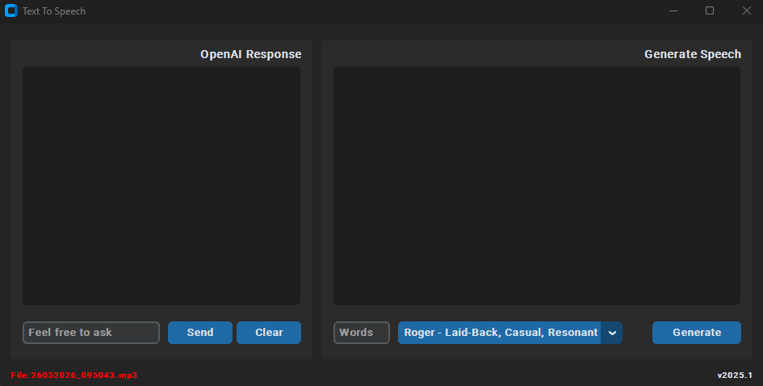
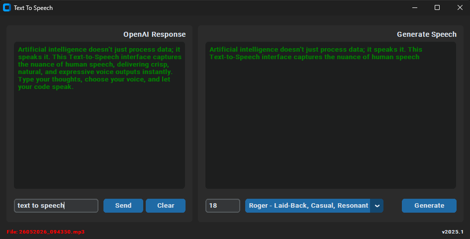

# 🎙️ AI-Powered Text-To-Speech Desktop App


> A desktop app that converts text into natural speech using AI voices (OpenAI + ElevenLabs + gTTS) with a modern CustomTkinter UI.

An interactive and modern Desktop Application built with Python using **CustomTkinter**. This app leverages the **OpenAI API** to generate smart text responses and integrates the **ElevenLabs API** to convert those responses into high-quality, realistic human speech.

---


## ✨ Features

*   **Modern UI**: Beautiful, clean, and fully responsive user interface using CustomTkinter's system-matching theme.
*   **AI Chat Generation**: Ask anything and get instant responses using OpenAI's powerful language models.
*   **Advanced Text-To-Speech (TTS)**: Convert AI-generated text or custom text snippets into natural-sounding speech.
*   **Voice Customization**: Dynamically fetches and allows you to choose from your available ElevenLabs voices via an interactive dropdown menu.
*   **Word Limiter**: Control how many words from the response you want to convert into speech.
*   **Auto-Save & Audio Logs**: Automatically saves all generated audio files in MP3 format inside an organized folder.

---


## 🛠️ Tech Stack & Architecture

This project is built using a modern, lightweight Python architecture that combines a powerful desktop user interface with cutting-edge cloud AI services.

*   **GUI Framework**: Built with **CustomTkinter**, providing a sleek, responsive, and hardware-accelerated user interface that natively supports dark and light system themes.
*   **Artificial Intelligence**: Powered by **OpenAI's Language Models** to understand user prompts and generate context-aware, smart textual answers.
*   **Speech Synthesis (TTS)**: Integrated with the **ElevenLabs API** to stream ultra-realistic, emotionally expressive, and high-fidelity human voices.
*   **System & Media Management**: 
    *   Uses system-level processing to ensure clean application closure and background thread termination.
    *   Handles instant multi-platform local audio playback immediately after files are dynamically generated.

---


## 🚀 Installation & Setup Guide

Follow these simple steps to run the application locally on your machine:

### Step 1: Install Python
Make sure you have the latest version of Python installed. If not, download and install it from the official site:
👉 [Download Python](https://www.python.org/downloads/)

### Step 2: Clone & Navigate to Project Folder
Open your Terminal (Mac/Linux) or Command Prompt (Windows) and navigate to the project directory:

```bash
git clone https://github.com/iamx-ariful-islam/Text-To-Speech.git
cd Text-To-Speech
```

### Step 3: Install Dependencies
Install all the required Python libraries using `pip`:

```bash
pip install -r requirements.txt
```

### Step 4: Add Your API Keys
Before running the application, you need to add your API credentials. Open `main.py` in your favorite code editor and fill in your keys:

1.  **OpenAI API Key**: Get it from your OpenAI Dashboard and replace:

    ```python
    openai.api_key = 'YOUR_OPENAI_API_KEY'
    ```
2.  **ElevenLabs API Key**: Get it from the [ElevenLabs Speech Synthesis Portal](https://beta.elevenlabs.io/speech-synthesis) and replace:

    ```python
    xi_api_key = 'YOUR_ELEVENLABS_API_KEY'
    ```


## 🎮 How to Use

1.  Start the application by executing the following command in your terminal:

    ```bash
    python main.py
    ```
2.  **Generate Text**: Type any prompt in the left entry box ("Feel free to ask") and hit **Enter** or click **Send**.
3.  **Filter Words (Optional)**: In the right panel, you can type a number in the "Words" entry to only speak the first *N* words of the text.
4.  **Select Voice**: Choose your preferred voice model from the ElevenLabs drop-down menu.
5.  **Listen**: Click the **Generate** button. The app will visually load the text and play the voice output automatically.
6.  **Reset**: Click **Clear** to wipe the screen data and start a fresh session.

---


## 📁 Project Structure

```text
Text-To-Speech/
│
├── audio_files/          # Directory where generated .mp3 logs are auto-saved
├── screenshots/          # Folder contains project screenshots
├── main.py               # Main application source code (GUI & API Logic)
│── LICENSE               # Github default license file
├── requirements.txt      # List of dependencies to install
└── README.md             # Project documentation (This file)
```


## 📸 Screenshots

Here is a preview of the modern interface and workflow of the application:

**Main Window**<br/>
<br/>
**Main Window-Output**<br/>



## 🔒 Security Note
> ⚠️ **Important**: Do not commit or push your actual API keys publicly to GitHub. Consider using environment variables (`os.environ`) if you plan to share this repository publicly.

---


## 💻 Quick Start Guide

```text
1. Download & Install python latest version if not installed (https://www.python.org/downloads/)
2. Open your Terminal/Command Prompt
3. Goto project folder(cd <folder_name> <press enter>). Exp. cd Text-To-Speech
4. Then install requirements modules(pip3 install -r requirements.txt)
5. Open 'main.py' file with editor mode
6. Add 'openai_api_key' for ChatGPT response
7. Add 'xi_api_key' for Text-To-Speech from Elevenlabs (https://beta.elevenlabs.io/speech-synthesis)
8. Then type python main.py and hit <enter>
```


## Contributing

Contributions, suggestions, and feedback are always welcome! ❤️
To contribute:

1. Fork the repository
1. Create a new branch (`feature/new-feature`)
1. Commit your changes
1. Push and submit a Pull Request

💬 You can also open an issue if you’d like to discuss a feature or report a bug.


## 🧩 Connect with me

<p align="center">
  <a href="https://github.com/iamx-ariful-islam"></a>&nbsp;&nbsp;
  <a href="https://bd.linkedin.com/in/iamx-ariful-islam"></a>&nbsp;&nbsp;
  <a href="https://x.com/mx_ariful_islam"></a>&nbsp;&nbsp;
  <a href="https://www.facebook.com/iamx.ariful.islam/"></a>
</p>


## 📄 License

The [MIT](https://choosealicense.com/licenses/mit/) License (MIT)


## 💖 Thank You for Visiting!

> “Good code speaks for itself, but great design gives it a real human voice.”  
> — *Ariful Islam*